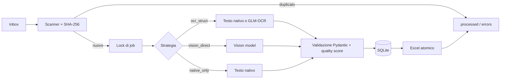

# DDT Local Extractor

Applicazione locale per estrarre dati da Documenti di Trasporto italiani (DDT), archiviarli in SQLite e produrre un Excel aggiornato. L’inferenza avviene tramite [Ollama](https://ollama.com/) sulla macchina locale: il progetto non invia PDF o dati estratti a servizi cloud.

Supporta PDF con testo nativo, PDF scansiti e immagini (`.jpg`, `.jpeg`, `.png`, `.webp`). Il dataset incluso contiene esclusivamente documenti fac-simile.

## App desktop — percorso consigliato

L'utente finale non deve usare il Terminale né impostare `DDT_HOME`.

1. Apri la [pagina di download](https://francemazzi.github.io/ddt-local-extractor/) e scarica lo ZIP per il tuo computer: macOS Apple Silicon, macOS Intel o Windows x64. I file sono pubblicati anche nelle [GitHub Releases](https://github.com/francemazzi/ddt-local-extractor/releases).
2. Estrai completamente lo ZIP, senza spostare i file al suo interno. Su Windows fai doppio clic su **`start.bat`**. Su Mac, **solo la prima volta**, tieni premuto `Ctrl`, fai clic su **`start.command`**, scegli **Apri** e conferma **Apri**; dalle volte successive basterà il doppio clic (`start.sh` è disponibile anche da Terminale).
3. Al primo avvio l'app apre il selettore cartella nativo: scegli la cartella DDT esatta, per esempio `Documenti/DDT`.
4. L'app crea automaticamente `inbox`, `processed`, `errors`, `output` e il database; controlla Ollama e guida al download dei due modelli richiesti.
5. Trascina i PDF in `inbox`. L'app li elabora automaticamente entro cinque minuti; la dashboard permette anche **Elabora ora**, **Apri inbox** e **Apri Excel**.

La release stabile corrente è **v1.0.0**. Verifica sempre che lo ZIP provenga dalla release ufficiale. Su macOS il primo avvio richiede `Ctrl` + clic su `start.command` → **Apri**; l'avviatore poi abilita i normali doppi clic successivi.

## Architettura



La strategia predefinita è `ocr_struct`: usa il testo nativo quando è sufficiente e GLM-OCR solo per le pagine scansite; un secondo modello produce JSON strutturato e validato. `vision_direct` è utile per confronti one-shot, mentre `native_only` è una baseline che fallisce esplicitamente sui documenti scansiti.

## Requisiti

- Python 3.12+
- Ollama avviato in locale
- Modelli: `glm-ocr:latest`, `qwen3.5:4b`; `qwen3.5:9b` è incluso nel benchmark standard

## Installazione tecnica macOS

Questa sezione è per sviluppatori, assistenza tecnica o esecuzione da repository. Per gli utenti finali usare l'app desktop sopra.

```bash
git clone https://github.com/francemazzi/ddt-local-extractor.git
cd ddt-local-extractor
python3.12 -m venv .venv
.venv/bin/pip install -e ".[dev]"
./scripts/pull_models.sh
.venv/bin/python -m ddt_local init
.venv/bin/python -m ddt_local doctor
```

Per una singola esecuzione si può usare anche il wrapper:

```bash
./scripts/run_macos.sh
```

Il wrapper usa `.venv/bin/python`; per usare un interprete diverso impostare `DDT_PYTHON=/percorso/python`.

## Installazione tecnica Windows

In PowerShell:

```powershell
git clone https://github.com/francemazzi/ddt-local-extractor.git
cd ddt-local-extractor
py -3.12 -m venv .venv
.venv\Scripts\pip install -e ".[dev]"
bash scripts/pull_models.sh
.venv\Scripts\python -m ddt_local init
.venv\Scripts\python -m ddt_local doctor
```

`pull_models.sh` richiede Git Bash o WSL. In alternativa eseguire:

```powershell
ollama pull glm-ocr:latest
ollama pull qwen3.5:4b
ollama pull qwen3.5:9b
```

Il wrapper Windows è [`scripts/run_windows.cmd`](scripts/run_windows.cmd) e può essere eseguito da `cmd.exe` o dal Task Scheduler.

## Configurazione

La configurazione avanzata è in variabili d’ambiente: copiare `.env.example` come riferimento o impostarle nel sistema. L'app desktop salva invece la scelta dell'utente senza richiedere variabili:

- macOS: `~/Library/Application Support/DDT Local Extractor/config.json`
- Windows: `%APPDATA%\DDT Local Extractor\config.json`

Se presente, la cartella salvata dall'app viene usata da CLI, runner e scheduler. `DDT_HOME` esplicita mantiene la precedenza per assistenza tecnica, test e automazioni.

| Variabile | Default | Scopo |
|---|---|---|
| `DDT_HOME` | `~/DDT` | Radice dell’area operativa |
| `OLLAMA_BASE_URL` | `http://localhost:11434` | Endpoint Ollama locale |
| `DDT_PIPELINE` | `ocr_struct` | `ocr_struct`, `vision_direct`, `native_only` |
| `DDT_OCR_MODEL` | `glm-ocr:latest` | Modello OCR per pagine scansite |
| `DDT_STRUCT_MODEL` | `qwen3.5:4b` | Modello che struttura testo/JSON |
| `DDT_VISION_MODEL` | `qwen3.5:4b` | Modello per `vision_direct` |
| `DDT_RENDER_DPI` | `250` | Risoluzione di rendering OCR |
| `DDT_MIN_NATIVE_TEXT_CHARS` | `200` | Soglia per considerare valida una pagina nativa |
| `DDT_FILE_STABILITY_SECONDS` | `3` | Attesa prima di leggere un file in scrittura |
| `DDT_REQUEST_TIMEOUT_SECONDS` | `180` | Timeout di una richiesta Ollama |
| `DDT_MAX_RETRIES` | `3` | Tentativi per richiesta Ollama |
| `DDT_KEEP_RAW_OCR` | `true` | Conserva artefatti OCR quando previsto |
| `DDT_LOG_LEVEL` | `INFO` | Livello dei log strutturati |

Cambiare modello o pipeline non richiede modifiche al codice: ad esempio `DDT_PIPELINE=native_only DDT_STRUCT_MODEL=qwen3.5:9b`.

## Uso quotidiano

Inizializzare una sola volta, poi copiare i PDF nella inbox:

```bash
python -m ddt_local init
cp /percorso/documento.pdf ~/DDT/inbox/
python -m ddt_local run --once
python -m ddt_local status
```

Comandi disponibili:

| Comando | Effetto |
|---|---|
| `init` | Crea directory operative e database SQLite |
| `doctor` | Controlla Python, cartelle/permesse, dipendenze, Ollama, modelli, SQLite ed Excel |
| `run --once` | Svuota la coda stabile e termina |
| `export` | Rigenera l’Excel soltanto dal database |
| `status` | Mostra coda, elaborati, errori e presenza dell’Excel |
| `reprocess SHA256` | Rimette in inbox un documento archiviato e lo rielabora |
| `benchmark ...` | Confronta configurazioni contro la ground truth |

Ogni job acquisisce un lock: una seconda esecuzione simultanea termina con successo senza elaborare lo stesso file. Lo SHA-256 rende idempotente la consegna duplicata; una copia già nota viene solo archiviata, senza nuova inferenza.

## Output e archiviazione

La struttura sotto `DDT_HOME` è:

```text
DDT/
├── inbox/                 # input da elaborare
├── processed/YYYY/MM/     # file estratti con successo
├── errors/YYYY/MM/        # file con errore di estrazione
├── data/ddt.sqlite3       # archivio transazionale
├── output/DDT_estratti.xlsx
├── benchmark/             # CSV/XLSX e artefatti benchmark
└── logs/
```

`DDT_estratti.xlsx` viene sostituito atomicamente e contiene:

- `DDT`: una riga per intestazione;
- `Righe`: una riga per articolo;
- `Errori`: errori di estrazione e validazione bloccanti;
- `Da verificare`: documenti con qualità insufficiente o campi ambigui.

Date e quantità sono esportate come veri valori Excel. Testi che iniziano con `=`, `+`, `-` o `@` vengono neutralizzati per impedire formula injection.

SQLite separa i documenti di produzione (`source_documents`, `ocr_pages`, `ddt_headers`, `ddt_lines`, `validation_issues`) dai risultati di benchmark. L’inserimento di un documento è transazionale: un errore non lascia intestazioni o righe parziali.

## Benchmark

Il benchmark esclude automaticamente il PDF raccolta e confronta le estrazioni con i JSON in `examples/ground_truth/`.

```bash
python -m ddt_local benchmark \
  --documents ./dataset \
  --ground-truth ./examples/ground_truth \
  --config ./examples/config/benchmark.yaml
```

Il file YAML controlla pipeline, modelli, DPI e ripetizioni. Per uno smoke test a due strategie su un PDF nativo, uno scansito e un edge case:

```bash
python -m ddt_local benchmark \
  --documents ./dataset \
  --ground-truth ./examples/ground_truth \
  --config ./examples/config/benchmark_smoke.yaml
```

I report CSV e XLSX sono scritti in `DDT_HOME/benchmark/`; la classifica per `weighted_score` è stampata anche nel terminale. Il benchmark non scrive nelle tabelle produttive `ddt_headers` e `ddt_lines`.

## Scheduling

macOS (agente utente launchd, ogni 5 minuti e al login):

```bash
./scripts/install_launchd.sh --dry-run  # mostra il plist senza installarlo
./scripts/install_launchd.sh
./scripts/install_launchd.sh --uninstall
```

Windows (Task Scheduler, ogni 5 minuti):

```powershell
.\scripts\install_task_scheduler.ps1
.\scripts\install_task_scheduler.ps1 -Uninstall
```

Entrambi gli scheduler eseguono un comando one-shot `run --once`; non esiste un servizio applicativo Python residente obbligatorio.

Nell'app desktop lo scheduler viene attivato dal wizard e richiama un runner invisibile ogni cinque minuti. Gli script in questa sezione restano strumenti tecnici; usano lo stesso backend dello scheduler grafico.

## Aggiungere un modello o una pipeline

Per provare un modello compatibile, installarlo con `ollama pull nome-modello`, impostare la relativa variabile `DDT_*_MODEL` e aggiungere una configurazione in `examples/config/benchmark.yaml`.

Per una nuova strategia, implementare il contratto `ExtractionPipeline` in `src/ddt_local/pipelines/`, registrarla nella factory e aggiungere test unitari e una voce benchmark. La validazione Pydantic e la persistenza restano comuni alle strategie.

## Privacy, backup e limiti

- I PDF, OCR, SQLite ed Excel restano nel percorso locale `DDT_HOME`; proteggere la cartella con le normali policy del dispositivo.
- I log strutturati evitano testo OCR e PII; non condividere comunque database o Excel senza autorizzazione.
- Fare backup regolare di `DDT_HOME/data/ddt.sqlite3`, `output/` e `processed/`. A job fermo, una copia consistente è sufficiente; per backup live usare il comando SQLite `.backup`.
- OCR e modelli generativi possono confondere colonne, quantità, numeri DDT o dati poco leggibili. Controllare sempre il foglio `Da verificare`, soprattutto per scansioni, documenti multi-pagina e valori negativi.
- Il risultato è uno strumento di supporto operativo, non una validazione fiscale o legale automatica.

## Troubleshooting

| Sintomo | Azione |
|---|---|
| `Ollama: UNAVAILABLE` | Avviare Ollama (`ollama serve`) e ripetere `doctor` |
| Modello `MISSING` | Eseguire `./scripts/pull_models.sh` oppure `ollama pull <modello>` |
| File resta in inbox | Attendere `DDT_FILE_STABILITY_SECONDS`, poi verificare `status` e `doctor` |
| Secondo job non elabora | È previsto: il lock protegge la coda; riprovare quando il primo job è finito |
| Excel non aggiornato | Eseguire `python -m ddt_local export` |
| Documento errato | Recuperare lo SHA-256 da SQLite/Excel e usare `python -m ddt_local reprocess <hash>` |

## Verifica sviluppo

```bash
pytest tests/ -m "not ollama"  # nessuna rete o modello
pytest tests/ -m ollama         # richiede Ollama e i modelli locali
python -m ddt_local doctor
```

Lo stato dettagliato delle fasi e i criteri di accettazione sono in [roadmap.md](roadmap.md).

## Build e pubblicazione degli archivi portabili

Le build sono prodotte nativamente dalla workflow GitHub **Publish desktop release**: genera uno ZIP portabile per Apple Silicon, uno per Mac Intel e uno per Windows x64. Ogni archivio contiene l'app, l'avviatore e un `LEGGIMI.txt`. Creare e inviare il tag `v1.0.0` avvia la pubblicazione; il deployment della pagina download viene eseguito a ogni aggiornamento di `main`.

Per attivare GitHub Pages la prima volta, nel repository scegliere **Settings → Pages → Build and deployment → GitHub Actions**. La pagina sarà disponibile su `https://francemazzi.github.io/ddt-local-extractor/`.

Per una build locale di sviluppo servono PyInstaller, Tcl/Tk e gli strumenti di packaging del sistema:

```bash
brew install python@3.12 python-tk@3.12
PYTHON_BIN="$(brew --prefix python@3.12)/bin/python3.12"
"$PYTHON_BIN" -m pip install -e ".[dev]"
VERSION=1.0.0 BUILD_LABEL=macOS-Apple-Silicon PYTHON_BIN="$PYTHON_BIN" bash scripts/build_macos.sh
```

Su Windows eseguire `scripts\build_windows.ps1 -Version 1.0.0` da PowerShell. La build produce direttamente lo ZIP portabile.
