# Roadmap — DDT Local Extractor

Sistema locale per estrazione automatica dei DDT (Documenti di Trasporto) con benchmark tra modelli Ollama.

**Stack:** Python 3.12 · Ollama · Pydantic 2 · PyMuPDF · Pillow · SQLite · openpyxl · httpx · pytest

**Dataset / ground truth:** cartella [`dataset/`](dataset/) (10 PDF + `ground_truth_ddt.json` + `ground_truth_righe.csv`)

**Stato progetto all’avvio:** solo `LICENSE` e `dataset/`. Nessun codice applicativo.

---

## Legenda checkbox e regole di avanzamento

Marcare una fase come `[x]` **solo** dopo aver superato i gate richiesti. Non segnare a priori.

| Gate | Comando tipico | Quando obbligatorio |
|------|----------------|---------------------|
| **Unitari** | `pytest tests/ -m "not ollama"` | Da **Fase 1** in poi, a ogni chiusura fase |
| **Ollama (integrazione)** | `pytest tests/ -m ollama` | Fasi **5, 6, 7, 9, 10, 12** (componenti che usano modelli) |
| **Benchmark** | `python -m ddt_local benchmark ...` | Fasi **10** e **12** (≥ 2 configurazioni su subset del dataset) |

Modelli Ollama per i gate di integrazione:

```bash
ollama pull glm-ocr:latest
ollama pull qwen3.5:4b
ollama pull qwen3.5:9b
```

Dopo ogni fase completata:

1. Eseguire i gate della fase
2. Aggiornare le checkbox della fase a `[x]`
3. Aggiungere una riga nel [Log avanzamento](#log-avanzamento)

```mermaid
flowchart TB
    subgraph fasi [Fasi sviluppo]
        F0[F0 Scaffolding]
        F1[F1 Fondamenta]
        F2[F2 Dataset adapter]
        F3[F3 Database]
        F4[F4 File e lock]
        F5[F5 Ollama client]
        F6[F6 PDF e OCR]
        F7[F7 Pipelines]
        F8[F8 Excel e persistenza]
        F9[F9 Job produzione]
        F10[F10 Benchmark]
        F11[F11 Script scheduling]
        F12[F12 Test docs accettazione]
        F13[F13 Primo avvio grafico]
        F0 --> F1 --> F2 --> F3 --> F4 --> F5 --> F6 --> F7 --> F8 --> F9 --> F10 --> F11 --> F12 --> F13
    end
```



---

## Dataset e adapter verso schema Pydantic

### Contenuto di `dataset/`

| Elemento | Descrizione |
|----------|-------------|
| `01`…`07`, `09` | PDF con testo nativo |
| `08`, `10` | PDF scansionati (`scan: true`) |
| `ground_truth_ddt.json` | GT annidato (schema inglese) |
| `ground_truth_righe.csv` | Una riga per articolo (separatore `;`) |
| `DDT_simulati_siderurgia_raccolta.pdf` | I 10 documenti uniti — **escludere** dal benchmark di default |
| `README_test_set.md` | Note su dati fittizi |

**Note utili per test e scoring:**

- Mix nativi/scansioni: ideale per confrontare `native_only` vs `ocr_struct`
- Doc `01` include riga `TAGLIO-01` con quantità **negativa** (caso limite scoring/quality)
- Tutti i dati sono sintetici (FAC-SIMILE)

### Mapping ground truth → `DocumentoDDT`

Il GT in `dataset/` usa nomi inglesi. L’adapter (Fase 2) deve produrre modelli Pydantic della spec.

| Campo dataset | Campo Pydantic |
|---------------|----------------|
| `sender.name` | `fornitore.ragione_sociale` |
| `sender.vat` | `fornitore.partita_iva` |
| `sender.address` + `city` | `fornitore.indirizzo` |
| `recipient.name` | `destinatario.ragione_sociale` |
| `recipient.vat` | `destinatario.partita_iva` |
| `recipient.address` + `city` | `destinatario.indirizzo` |
| `ddt_number` | `documento.numero_ddt` |
| `date` (`DD/MM/YYYY`) | `documento.data_ddt` (ISO / `date`) |
| `order_ref` | `documento.riferimento_ordine` |
| `reason` | `documento.causale_trasporto` |
| `packages` | `documento.numero_colli` (parse se possibile → `Decimal`) |
| `net_weight` / `gross_weight` | `documento.peso_netto` / `peso_lordo` (`Decimal`) |
| `carrier` | `documento.vettore` |
| `destination` | `documento.destinazione` |
| `items[].code` | `articoli[].codice` |
| `items[].description` | `articoli[].descrizione` |
| `items[].um` | `articoli[].unita_misura` |
| `items[].qty` | `articoli[].quantita` (`Decimal`) |
| `items[].lot` | `articoli[].lotto` |

`quality_score`, `campi_da_verificare`, `warning` **non** fanno parte della ground truth.

Percorsi di lavoro previsti:

- Sorgente primaria: `dataset/`
- Esempi per CLI / README: `examples/ddt/`, `examples/ground_truth/` (JSON per documento, schema Pydantic), `examples/config/benchmark.yaml`

---

## Comandi gate globali

```bash
# Installazione sviluppo
python3.12 -m venv .venv
source .venv/bin/activate   # Windows: .venv\Scripts\activate
pip install -e ".[dev]"

# Test unitari (obbligatori: no rete, no modelli)
pytest tests/ -m "not ollama"

# Test integrazione Ollama (modelli già pullati)
pytest tests/ -m ollama

# Sanity operativa
python -m ddt_local doctor

# Benchmark (almeno 2 run sul dataset)
python -m ddt_local benchmark \
  --documents ./dataset \
  --ground-truth ./examples/ground_truth \
  --config ./examples/config/benchmark.yaml
```

---

## Fase 0 — Scaffolding progetto

- [x] **Fase 0 completata**

**Obiettivo:** struttura eseguibile minima, zero logica business.

### Checklist deliverable

- [x] `pyproject.toml` (Python 3.12; pydantic, pymupdf, pillow, openpyxl, httpx, pytest, filelock, pyyaml/tomli)
- [x] Package `src/ddt_local/` con `__init__.py`, `__main__.py`, stub `cli.py`
- [x] `.env.example` (variabili della spec)
- [x] `.gitignore`
- [x] Skeleton `examples/config/benchmark.yaml`
- [x] `dataset/` tracciato in git (se non già committato)

### Gate

```bash
pip install -e ".[dev]"
python -m ddt_local --help
```

**Ollama / benchmark:** non richiesti in questa fase.

---

## Fase 1 — Fondamenta: modelli, config, logging, protocollo pipeline

- [x] **Fase 1 completata**

**Obiettivo:** contratti condivisi tra produzione e benchmark.

### Checklist deliverable

- [x] `src/ddt_local/models.py` — `Soggetto`, `RigaDDT`, `DatiDocumento`, `DocumentoDDT`, `ExtractionResult`, export JSON Schema
- [x] `src/ddt_local/config.py` — variabili `DDT_*` / `OLLAMA_*`
- [x] `src/ddt_local/logging_config.py` — log strutturati, senza PII nei log
- [x] `src/ddt_local/pipelines/base.py` — `ExtractionPipeline` Protocol + factory da `DDT_PIPELINE`
- [x] Test: parsing JSON, validazione Pydantic, selezione pipeline

### Gate

```bash
pytest tests/ -m "not ollama"
# focus consigliato:
pytest tests/test_models.py tests/test_config.py tests/test_pipelines_factory.py
```

**Ollama / benchmark:** non richiesti.

---

## Fase 2 — Dataset adapter e examples

- [x] **Fase 2 completata**

**Obiettivo:** collegare `dataset/` al benchmark senza riscrivere il GT a mano.

### Checklist deliverable

- [x] `src/ddt_local/benchmark/ground_truth.py` — loader `ground_truth_ddt.json` → `DocumentoDDT`
- [x] `examples/ddt/` — symlink o copia dei 10 PDF singoli (no raccolta)
- [x] `examples/ground_truth/` — un JSON per documento (schema Pydantic)
- [x] `scripts/generate_ground_truth_examples.py`
- [x] `examples/config/benchmark.yaml` — run: `ocr_qwen4b`, `ocr_qwen9b`, `vision_qwen4b`, `vision_qwen9b`, `native_only`

### Gate

```bash
pytest tests/ -m "not ollama"
# focus: normalizzazione date, Decimal, mapping campi, null handling
pytest tests/test_ground_truth.py
```

**Ollama / benchmark:** non richiesti.

---

## Fase 3 — Database SQLite

- [x] **Fase 3 completata**

**Obiettivo:** persistenza transazionale; produzione e benchmark separati.

### Checklist deliverable

- [x] `src/ddt_local/database.py` — tabelle: `source_documents`, `ocr_pages`, `ddt_headers`, `ddt_lines`, `validation_issues`, `benchmark_runs`, `benchmark_results`
- [x] SHA-256 UNIQUE su `source_documents`, FK, transazioni
- [ ] Stub CLI `init` → crea `~/DDT/data/ddt.sqlite3` (o `DDT_HOME`) *(previsto Fase 9)*

### Gate

```bash
pytest tests/ -m "not ollama"
pytest tests/test_database.py
```

**Ollama / benchmark:** non richiesti.

---

## Fase 4 — Gestione file, lock, stabilità

- [x] **Fase 4 completata**

**Obiettivo:** idempotenza e sicurezza multipiattaforma.

### Checklist deliverable

- [x] `src/ddt_local/files.py` — lock, stabilità file, SHA-256, move `processed/YYYY/MM/` / `errors/YYYY/MM/`, sanitizzazione, anti path-traversal
- [x] `src/ddt_local/scanner.py` — scan inbox, skip duplicati per hash

### Gate

```bash
pytest tests/ -m "not ollama"
pytest tests/test_files.py tests/test_scanner.py
```

**Ollama / benchmark:** non richiesti.

---

## Fase 5 — Client Ollama

- [x] **Fase 5 completata** (richiede gate Ollama)

**Obiettivo:** client HTTP riusabile (retry, memoria, structured output).

### Checklist deliverable

- [x] `src/ddt_local/ollama.py` — health, lista modelli, `POST /api/generate`, `format` structured output, `keep_alive: 0`, temperatura 0, seed, tracemalloc
- [x] Errori gestiti: servizio down, modello assente, timeout, risposta vuota

### Gate

```bash
pytest tests/ -m "not ollama"
pytest tests/test_ollama.py          # mock httpx

# Integrazione (Ollama avviato + modelli pullati)
pytest tests/ -m ollama
```

---

## Fase 6 — Pipeline PDF e OCR

- [x] **Fase 6 completata** (richiede gate Ollama)

**Obiettivo:** testo nativo + rendering + GLM-OCR.

### Checklist deliverable

- [x] `src/ddt_local/pdf.py` — PyMuPDF, soglia testo nativo, PNG a `DDT_RENDER_DPI`, cleanup temp
- [x] `src/ddt_local/ocr.py` — GLM-OCR `/api/generate`, doppio passaggio tabelle opzionale, concatenazione pagine

### Gate

```bash
pytest tests/ -m "not ollama"
pytest tests/test_pdf.py tests/test_ocr.py

# Integrazione: OCR su scansione dataset
pytest tests/ -m ollama
# Criterio: OCR su dataset/08_DDT_Inox_Labirinto_scansione.pdf → testo non vuoto
```

---

## Fase 7 — Pipelines di estrazione (3 strategie)

- [x] **Fase 7 completata** (richiede gate Ollama)

**Obiettivo:** strategie intercambiabili senza duplicazione di codice.

### Checklist deliverable

- [x] `pipelines/ocr_struct.py` — default produzione
- [x] `pipelines/vision_direct.py` — vision one-shot
- [x] `pipelines/native_only.py` — baseline; fail esplicito su scansioni
- [x] `validation.py` — Pydantic + una riparazione controllata
- [x] `quality.py` — `quality_score` deterministico, `requires_review`
- [x] `extractor.py` — `ExtractionResult` con metadati per fase

### Gate

```bash
pytest tests/ -m "not ollama"
pytest tests/test_validation.py tests/test_quality.py tests/test_pipelines.py

# Integrazione: ocr_struct su PDF nativo
pytest tests/ -m ollama
# Criterio: dataset/01_DDT_Acciai_Nordest.pdf → DocumentoDDT valido
```

---

## Fase 8 — Export Excel e persistenza produzione

- [x] **Fase 8 completata**

**Obiettivo:** output utente e archivio completo.

### Checklist deliverable

- [x] `src/ddt_local/excel.py` — fogli `DDT`, `Righe`, `Errori`, `Da verificare`; scrittura atomica; protezione formula injection
- [x] Integrazione extractor → DB → Excel nel flusso di run

### Gate

```bash
pytest tests/ -m "not ollama"
pytest tests/test_excel.py
# Criteri: fogli, date Excel, numeri, neutralizzazione = + - @; rollback DB su errore
```

**Ollama:** non obbligatorio se i test usano dati in memoria / fixture.

---

## Fase 9 — Job produzione end-to-end

- [x] **Fase 9 completata** (richiede gate Ollama)

**Obiettivo:** job one-shot da inbox a processed/errors.

### Checklist deliverable

- [x] CLI completa: `init`, `doctor`, `run --once`, `export`, `status`, `reprocess`
- [x] Flusso: scan → lock → hash → extract → DB → Excel atomico → move → exit 0
- [x] `doctor`: Python, dir, permessi, Ollama, modelli, SQLite, Excel

### Gate

```bash
pytest tests/ -m "not ollama"
# Criteri unit: coda vuota → exit 0; duplicato non rielaborato; lock → exit 0

python -m ddt_local doctor
pytest tests/ -m ollama
# Criterio: run --once su 1 PDF nativo + 1 scansione da dataset/ → SQLite + Excel
```

Esempio manuale (dopo `init`):

```bash
cp dataset/01_DDT_Acciai_Nordest.pdf ~/DDT/inbox/
cp dataset/08_DDT_Inox_Labirinto_scansione.pdf ~/DDT/inbox/
python -m ddt_local run --once
python -m ddt_local status
```

---

## Fase 10 — Modulo benchmark (scoring, runner, report)

- [x] **Fase 10 completata** (richiede gate Ollama + benchmark)

**Obiettivo:** confronto configurazioni locali vs ground truth (modulo di prima classe).

### Checklist deliverable

- [x] `benchmark/scoring.py` — metriche campi, allineamento righe (codice+qty, fallback descrizione), pesi, score aggregato
- [x] `benchmark/runner.py` — YAML config, `repetitions`, unload modelli tra run, tabelle `benchmark_*`
- [x] `benchmark/report.py` — CSV, Excel comparativo, classifica a terminale
- [x] CLI `benchmark` con `--documents`, `--ground-truth`, `--config`, `--runs-filter`, `--repetitions`, `--keep-artifacts`

### Gate

```bash
pytest tests/ -m "not ollama"
pytest tests/test_benchmark_scoring.py
# Criteri: trovate/mancanti/inventate, null GT, pesi, quantità in formati diversi

pytest tests/ -m ollama

python -m ddt_local benchmark \
  --documents ./dataset \
  --ground-truth ./examples/ground_truth \
  --config ./examples/config/benchmark.yaml \
  --runs-filter ocr_qwen4b   # opzionale: filtrare per smoke test
```

**Criterio integrazione:** ≥ **2 configurazioni** × **3 documenti** (1 nativo, 1 scansione, 1 edge case) → CSV + Excel in `~/DDT/benchmark/` + classifica a terminale. Non toccare `ddt_headers` / `ddt_lines` di produzione.

---

## Fase 11 — Script multipiattaforma e scheduling

- [x] **Fase 11 completata**

**Obiettivo:** esecuzione via launchd, Task Scheduler, terminale.

### Checklist deliverable

- [x] `scripts/run_macos.sh`
- [x] `scripts/run_windows.cmd`
- [x] `scripts/install_launchd.sh`
- [x] `scripts/install_task_scheduler.ps1`
- [x] `scripts/pull_models.sh`

### Gate

```bash
pytest tests/ -m "not ollama"
# Script eseguibili; install_launchd.sh genera plist valido (dry-run / verifica struttura)
bash -n scripts/run_macos.sh
bash -n scripts/install_launchd.sh
bash -n scripts/pull_models.sh
```

**Ollama / benchmark:** non obbligatori (salvo verifica `pull_models.sh` a mano).

---

## Fase 12 — Test suite completa, README, accettazione finale

- [x] **Fase 12 completata — PROGETTO ACCETTATO**

**Obiettivo:** copertura test della spec + documentazione + 17 criteri di accettazione.

### Checklist deliverable

- [x] Suite pytest completa (mock Ollama nei unitari; `@pytest.mark.ollama` per integrazione)
- [x] `README.md` (architettura, diagramma strategie, install macOS/Windows, Ollama, config, job, SQLite, Excel, guida benchmark, troubleshooting, privacy, limiti OCR, backup, come aggiungere modello/pipeline)
- [x] Checklist [Criteri di accettazione](#criteri-di-accettazione) tutta `[x]`

### Gate finale

```bash
pytest tests/ -m "not ollama"
pytest tests/ -m ollama
python -m ddt_local doctor

python -m ddt_local benchmark \
  --documents ./dataset \
  --ground-truth ./examples/ground_truth \
  --config ./examples/config/benchmark.yaml
# full run opzionale: 10 doc × N config (escludere raccolta.pdf)
```

---

## Fase 13 — Primo avvio grafico e cartella DDT persistente

- [ ] **Automazione implementata — in attesa di accettazione manuale dell'installer**

**Obiettivo:** distribuire una prima esperienza macOS/Windows senza Terminale: scelta grafica della cartella una sola volta, verifica Ollama, runner invisibile e pianificazione ogni cinque minuti.

### Checklist deliverable

- [x] Configurazione JSON atomica per utente (`Application Support` su macOS, `%APPDATA%` su Windows), con precedenza `DDT_HOME` → configurazione grafica → `~/DDT`
- [x] Wizard Tkinter con selettore cartella nativo, verifica scrittura, layout completo, SQLite ed Excel iniziale
- [x] Guida Ollama: pagina ufficiale, retry, download progressivo di `glm-ocr:latest` e `qwen3.5:4b`
- [x] Dashboard: stato, apri inbox/Excel, elabora ora e cambio cartella confermato senza migrare lo storico
- [x] Runner `--run-once` senza UI, log su file e uso della configurazione persistente
- [x] Backend scheduler per utente: `launchd` e Task Scheduler; gli script tecnici esistenti delegano allo stesso backend
- [x] Build native PyInstaller: `.app`/DMG macOS, `.exe`/Inno Setup Windows, installatori unsigned documentati
- [x] Workflow GitHub Actions per build nativa, test unitari e smoke del runner confezionato su macOS e Windows
- [x] Test di configurazione, wizard/controller, runner, scheduler, packaging e CLI

### Gate

```bash
pytest tests/ -m "not ollama"
pytest tests/ -m ollama

# smoke runner confezionato da ambiente pulito
python -m PyInstaller --noconfirm --clean --paths src --exclude-module nltk \
  --onefile --name ddt-local-runner src/ddt_local/desktop_runner.py
DDT_USER_CONFIG=/tmp/ddt-settings.json ./dist/ddt-local-runner --run-once
```

**Accettazione ancora richiesta:** installare il DMG/EXE prodotto dalla CI su una macchina utente, completare il wizard senza Terminale, trascinare un PDF in `inbox` e verificare PDF archiviato ed Excel aggiornato entro cinque minuti.

---

## Criteri di accettazione

Aggiornare a `[x]` solo dopo verifica reale (mappatura alle fasi indicative).

- [x] 1. `python -m ddt_local init` crea l’ambiente operativo — *F9 / F3*
- [x] 2. `python -m ddt_local doctor` verifica dipendenze e modelli — *F9*
- [x] 3. PDF digitale elaborato senza OCR visuale quando possibile — *F6 / F7*
- [x] 4. PDF scansionato elaborato tramite GLM-OCR — *F6 / F7*
- [x] 5. Risultato validato con Pydantic — *F7*
- [x] 6. SQLite: intestazione, pagine OCR, righe, problemi — *F3 / F8*
- [x] 7. Excel con fogli richiesti — *F8*
- [x] 8. Documento duplicato non rielaborato in produzione — *F4 / F9*
- [x] 9. Due job simultanei non elaborano lo stesso file — *F4 / F9*
- [x] 10. Errore non lascia il DB in stato parziale — *F3 / F8*
- [x] 11. Documento spostato in `processed` o `errors` — *F4 / F9*
- [x] 12. Job termina dopo aver svuotato la coda — *F9*
- [x] 13. `benchmark` esegue ≥ 2 config sugli esempi e produce CSV, Excel, classifica — *F10*
- [x] 14. Cambiare modello/pipeline = solo config, senza toccare codice — *F1 / F7 / F10*
- [x] 15. Tutti i test unitari passano senza modelli né rete — *F12*
- [x] 16. Funziona su macOS e Windows — *F11 / F12*
- [x] 17. Nessun servizio applicativo resident obbligatorio — *architettura globale*
- [ ] 18. Primo avvio senza Terminale: scelta cartella persistente, modelli guidati e job automatico ogni 5 minuti — *F13, accettazione installer manuale*

---

## Comandi rapidi (post-implementazione)

```bash
# Setup
pip install -e ".[dev]"
./scripts/pull_models.sh
python -m ddt_local init
python -m ddt_local doctor

# Primo DDT
cp dataset/01_DDT_Acciai_Nordest.pdf ~/DDT/inbox/
python -m ddt_local run --once
python -m ddt_local status
# Output: ~/DDT/output/DDT_estratti.xlsx

# Primo benchmark
python -m ddt_local benchmark \
  --documents ./dataset \
  --ground-truth ./examples/ground_truth \
  --config ./examples/config/benchmark.yaml

# Solo unitari (CI / chiusura fase senza GPU)
pytest tests/ -m "not ollama"
```

---

## Log avanzamento

Alla chiusura di ogni fase aggiungere una riga. Segnare `PASS` / `FAIL` / `N/A` per i gate.

| Data | Fase | Unit test | Ollama | Benchmark | Note |
|------|------|-----------|--------|-----------|------|
| 2026-07-15 | 0 | N/A | N/A | N/A | Scaffolding: pip install -e, CLI --help OK |
| 2026-07-15 | 2 | PASS (37) | N/A | N/A | GT adapter, 10 examples JSON, benchmark.yaml |
| 2026-07-15 | 3 | PASS (62) | N/A | N/A | SQLite 7 tabelle, transazioni, FK cascade |
| 2026-07-15 | 4 | PASS (62) | N/A | N/A | lock, hash, stabilità, scanner inbox |
| 2026-07-15 | 5 | PASS (62) | PASS (1) | N/A | Ollama client mock + health integration |
| 2026-07-15 | 6 | PASS (74) | PASS (12) | N/A | pdf.py, ocr.py, GLM-OCR su scansione 08 |
| 2026-07-15 | 7 | PASS | PASS | N/A | ocr_struct/vision/native; ocr_struct su doc 01 OK |
| 2026-07-15 | 10 | PASS | PASS | PASS | 10 doc × 5 config; rank: ocr_qwen4b 0.77 |
| 2026-07-18 | 8 | PASS (108) | N/A | N/A | Persistenza produzione transazionale; Excel atomico con 4 fogli e anti-formula injection |
| 2026-07-18 | 9 | PASS (116) | PASS (15) | N/A | CLI completa; run reale su 01 nativo + 08 scansione → SQLite, Excel e 2 PDF archiviati |
| 2026-07-18 | 11 | PASS (123) | N/A | N/A | Wrapper macOS eseguito; plist launchd validato in dry-run; script PowerShell validato dal parser |
| 2026-07-18 | 12 | PASS (126) | PASS (15) | PASS (2 config × 3 PDF) | README completo; CI macOS/Windows verde, inclusa esecuzione di entrambi i wrapper |
| 2026-07-19 | 13 | PASS (151) | PASS (15) | N/A | Configurazione persistente, wizard/dashboard, scheduler nativo e runner PyInstaller pulito: SQLite, Excel e log OK. In attesa di build CI/accettazione installer manuale. |

---

## Riferimento file target (struttura finale)

```text
project/
├── roadmap.md                 ← questo file
├── pyproject.toml
├── README.md
├── .env.example
├── dataset/                   ← ground truth e PDF di test
├── src/ddt_local/
│   ├── cli.py
│   ├── config.py
│   ├── models.py
│   ├── database.py
│   ├── scanner.py
│   ├── pdf.py
│   ├── ocr.py
│   ├── ollama.py
│   ├── extractor.py
│   ├── validation.py
│   ├── quality.py
│   ├── excel.py
│   ├── files.py
│   ├── logging_config.py
│   ├── user_config.py
│   ├── scheduler.py
│   ├── desktop_services.py
│   ├── desktop_gui.py
│   ├── desktop_runner.py
│   ├── pipelines/
│   │   ├── base.py
│   │   ├── ocr_struct.py
│   │   ├── vision_direct.py
│   │   └── native_only.py
│   └── benchmark/
│       ├── ground_truth.py
│       ├── runner.py
│       ├── scoring.py
│       └── report.py
├── tests/
├── scripts/
├── packaging/
├── .github/workflows/
└── examples/
    ├── ddt/
    ├── ground_truth/
    └── config/benchmark.yaml
```
